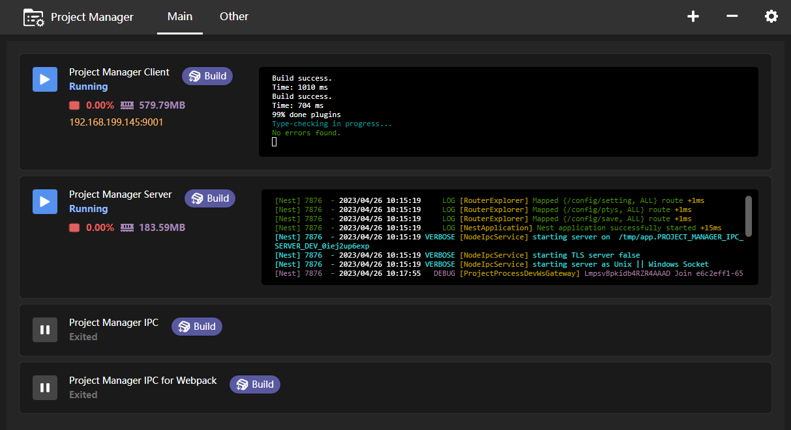

# Project Manager

## Usage

```bash
npx pm-gui # [--port=4000] [--db=path/to/sqlite/db] [--pwd=123456]
```

open browser and visit `http://localhost:4000`

## Args

### port

- listen port
- default: `4000`

### db

- app local storage
- default: `cwd/config/app.db`

### pwd

- app auth password
- default:

## IPC

add [project-manager-ipc](https://www.npmjs.com/package/project-manager-ipc) to project for
emit dev info and build dist to pm-gui

```ts
import ProjectManagerIpc from "project-manager-ipc";
const ipc = new ProjectManagerIpc();
ipc.connect();

// Run Dev
YourDevScript(() => {
  ipc.emitUrl("0.0.0.0", 1234);
});
// Build Success
YourBuildScript(() => {
  ipc.emitDist("path/to/dist");
  // or
  ipc.emitDist("path/to/dist", { version: "1.0.0", name: "name" }});
});
```

or use [project-manager-webpack-plugin](https://www.npmjs.com/package/project-manager-webpack-plugin) to auto emit dist with webpack

```ts
import ProjectManagerWebpackPlugin from "project-manager-webpack-plugin";

const webpackConfig = {
  //...
  plugins: [
    new ProjectManagerWebpackPlugin({
      // send dev host and port
      devInfo: () => ({
        host: "0.0.0.0",
        port: 1234,
      }),
      // outpath will be auto emit
    }),
  ],
};
```

## Demo



## changelog
### [1.4.3] 2024-04-19
- add deploy post progress

### [1.4.2] 2024-01-16

- deploy post version and extra args

### [1.4.1] 2024-01-16

- add project output version

### [1.4.0] 2024-01-15

- add password auth

### [1.3.0] 2023-12-07

- add project deploy

### [1.2.3] 2023-11-28

- add process resume

### [1.2.0] 2023-11-27

- next project process

### [1.1.0] 2023-10-31

- change usage to process
- add db backup file

### [1.0.8] 2023-05-23

- add build/dev proc `env` and `encoding`

### [1.0.7] 2023-05-22

- When the project is stopped, click on the status label to display the terminal.

### [1.0.6] 2023-05-08

- change project sort
- add project created_at

### [1.0.5] 2023-05-06

- category orderby sort asc
- xterm use canvas renderer

### [1.0.4] 2023-05-06

- merge project devInfo request
- show cpu/memory on homepage

### [1.0.3] 2023-05-05

- update db file save method
